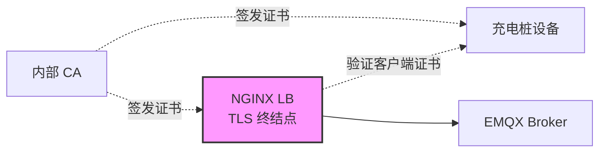
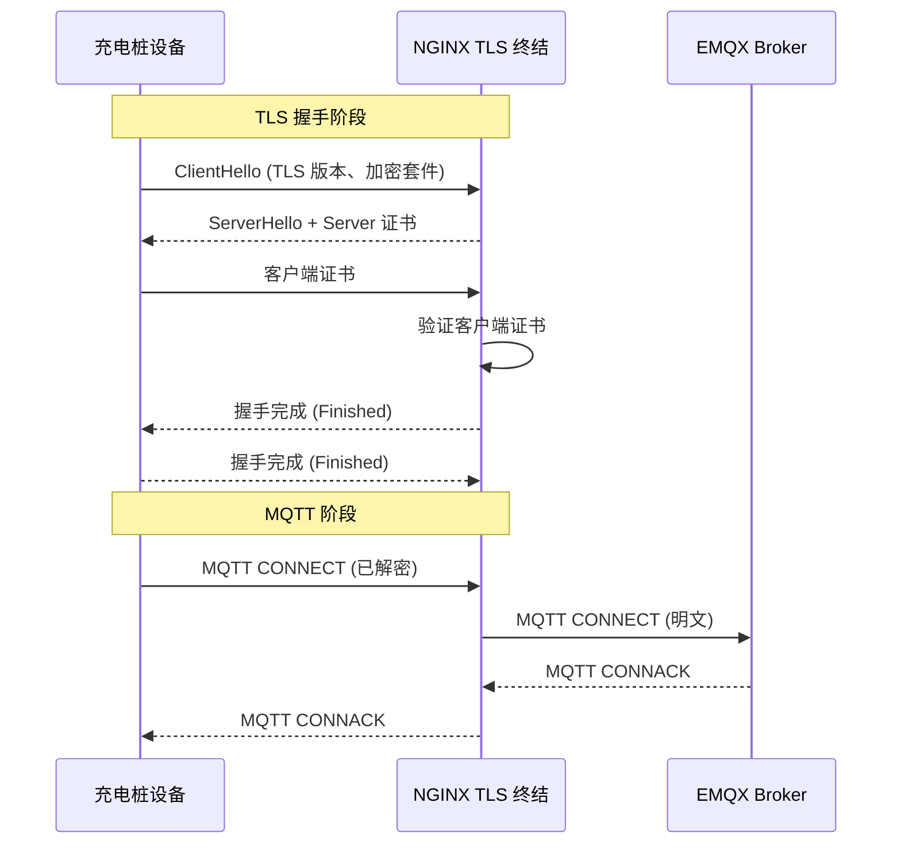
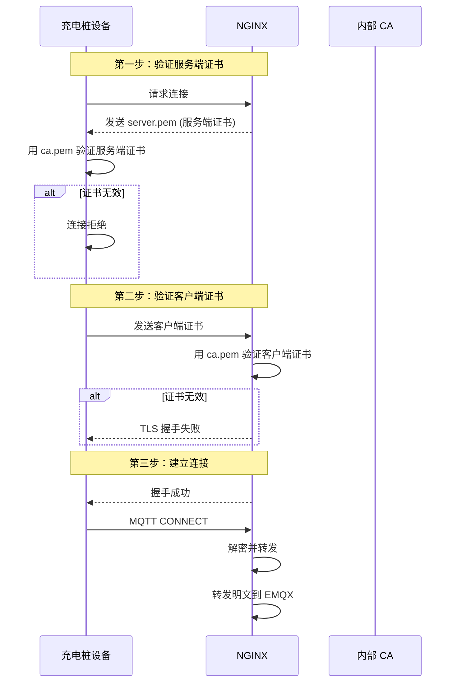

# 充电桩 TLS 终结认证方案

## 1. 文档目的

本文档定义充电桩系统中 **TLS 终结（TLS Termination）** 的认证方案，覆盖：

- TLS 终结原理与架构
- 证书配置（服务端证书、客户端证书、CA 证书）
- NGINX 配置方案与参数说明
- 私钥安全加载方案（600 权限控制）
- 虚拟机部署指南（bash 脚本管理）
- 证书校验流程

---

## 2. 总体架构

### 2.1 TLS 终结架构图



### 2.2 组件职责

| 组件        | 职责                                     |
| ----------- | ---------------------------------------- |
| 充电桩设备  | 持有客户端证书，建立 TLS 连接            |
| NGINX LB    | TLS 终结，验证客户端证书，转发解密后流量 |
| EMQX Broker | 接收解密后的 MQTT 流量                   |
| 内部 CA     | 签发服务端证书与客户端证书               |

---

## 3. TLS 终结原理

### 3.1 什么是 TLS 终结

TLS 终结指在网关/负载均衡层终止 TLS 连接，解密后的流量以明文形式转发到后端服务。

**优势：**

- 后端服务无需实现 TLS，降低复杂度
- 统一处理证书认证，集中管理
- 减轻后端计算压力

### 3.2 MQTT over TLS 流程



---

## 4. 证书配置方案

### 4.1 证书类型

| 证书类型   | 用途                         | 持有者     |
| ---------- | ---------------------------- | ---------- |
| 服务端证书 | 证明服务器身份，供客户端验证 | NGINX      |
| 客户端证书 | 证明客户端身份，供服务器验证 | 充电桩设备 |
| CA 证书    | 签发并验证其他证书           | CA         |

### 4.2 证书链结构

```
内部根 CA
    └── 中间 CA（可选）
            └── 服务端证书 (NGINX 使用)
            └── 客户端证书 (充电桩设备使用)
```

### 4.3 证书配置清单

| 文件         | 用途                    | NGINX 配置项             |
| ------------ | ----------------------- | ------------------------ |
| `server.pem` | 服务端证书              | `ssl_certificate`        |
| `server.key` | 服务端私钥              | `ssl_certificate_key`    |
| `ca.pem`     | CA 证书（验证客户端用） | `ssl_client_certificate` |

---

## 5. NGINX 配置方案

### 5.1 完整配置

```nginx
events {
    worker_connections 1024;
}

stream {
    upstream mqtt_backend {
        server emqx_v57:1883;
    }

    # MQTT over SSL/TLS
    server {
        listen 8883 ssl;

        # ========== 服务端证书 ==========
        ssl_certificate /etc/nginx/certs/server.pem;
        ssl_certificate_key /etc/nginx/certs/server.key;

        # ========== 客户端证书验证 ==========
        ssl_client_certificate /etc/nginx/certs/ca.pem;
        ssl_verify_client on;
        ssl_verify_depth 2;

        # ========== TLS 版本与加密套件 ==========
        ssl_protocols TLSv1.2 TLSv1.3;
        ssl_ciphers ECDHE-ECDSA-AES128-GCM-SHA256:ECDHE-RSA-AES128-GCM-SHA256:ECDHE-ECDSA-AES256-GCM-SHA384:ECDHE-RSA-AES256-GCM-SHA384:ECDHE-ECDSA-CHACHA20-POLY1305:ECDHE-RSA-CHACHA20-POLY1305;
        ssl_prefer_server_ciphers off;

        # ========== 代理配置 ==========
        proxy_pass mqtt_backend;
        proxy_buffer_size 4k;
    }
}
```

### 5.2 配置参数说明

#### 5.2.1 服务端证书配置

| 参数                  | 值                            | 说明           |
| --------------------- | ----------------------------- | -------------- |
| `ssl_certificate`     | `/etc/nginx/certs/server.pem` | 服务端公钥证书 |
| `ssl_certificate_key` | `/etc/nginx/certs/server.key` | 服务端私钥     |

#### 5.2.2 客户端证书验证配置

| 参数                     | 值                        | 说明                                   |
| ------------------------ | ------------------------- | -------------------------------------- |
| `ssl_client_certificate` | `/etc/nginx/certs/ca.pem` | CA 证书链，用于验证客户端证书          |
| `ssl_verify_client`      | `on`                      | 开启客户端证书验证（必须提供有效证书） |
| `ssl_verify_depth`       | `2`                       | 证书链验证深度（CA → 客户端证书）      |

#### 5.2.3 TLS 协议与加密套件配置

| 参数                        | 值                | 说明                   |
| --------------------------- | ----------------- | ---------------------- |
| `ssl_protocols`             | `TLSv1.2 TLSv1.3` | 支持 TLS 1.2 和 1.3    |
| `ssl_ciphers`               | 列表              | 指定允许的加密套件     |
| `ssl_prefer_server_ciphers` | `off`             | 客户端优先选择加密套件 |

**加密套件说明：**

| 加密套件                        | 算法                      |
| ------------------------------- | ------------------------- |
| `ECDHE-ECDSA-AES128-GCM-SHA256` | ECDSA + AES-128-GCM       |
| `ECDHE-RSA-AES128-GCM-SHA256`   | RSA + AES-128-GCM         |
| `ECDHE-ECDSA-AES256-GCM-SHA384` | ECDSA + AES-256-GCM       |
| `ECDHE-RSA-AES256-GCM-SHA384`   | RSA + AES-256-GCM         |
| `ECDHE-ECDSA-CHACHA20-POLY1305` | ECDSA + ChaCha20-Poly1305 |
| `ECDHE-RSA-CHACHA20-POLY1305`   | RSA + ChaCha20-Poly1305   |

#### 5.2.5 代理配置

| 参数                | 值             | 说明            |
| ------------------- | -------------- | --------------- |
| `proxy_pass`        | `mqtt_backend` | 转发到后端 EMQX |
| `proxy_buffer_size` | `4k`           | 代理缓冲区大小  |

### 5.3 私钥安全加载方案

#### 5.3.1 问题背景

NGINX TLS 终结时必须持有**私钥明文**才能完成解密。传统方案将私钥以明文存储在磁盘，存在权限失控风险。

#### 5.3.2 权限模型

| 进程        | 运行用户          | 私钥访问权限             |
| ----------- | ----------------- | ------------------------ |
| master 进程 | root              | 可读取私钥（启动时加载） |
| worker 进程 | nginx（普通用户） | 不可读取私钥             |

#### 5.3.3 方案设计

**文件权限配置：**

- 私钥文件权限：`600`（仅所有者可读写）
- 私钥属主：`root:root`
- 其他用户无权访问

**启动方式：**

- master 进程以 root 运行，启动时加载私钥
- worker 进程降权为 `nginx` 普通用户运行
- nginx.conf 中通过 `user nginx;` 指定 worker 用户

**安全逻辑：**

```
root 启动 master → master 读取私钥（600权限） → master fork worker（nginx用户）→ worker 无法访问私钥
```

#### 5.3.4 启动脚本 start.sh

```bash
#!/bin/bash
set -e

# 以 root 启动 nginx，master 读取私钥后 fork worker（nginx 用户）
exec /usr/sbin/nginx -c /etc/nginx/nginx.conf
```

**说明：** master 进程以 root 运行，读取明文私钥后 fork worker，worker 降权为 nginx 无法读取私钥文件。

#### 5.3.5 服务管理脚本

**停止脚本 stop.sh**

```bash
#!/bin/bash
/usr/sbin/nginx -s stop
echo "NGINX stopped"
```

**服务管理脚本 reload.sh**

```bash
#!/bin/bash
/usr/sbin/nginx -s reload
echo "NGINX reloaded"
```

**说明：**

- master 进程以 root 运行，读取明文私钥后 fork worker，worker 降权为 nginx 无法读取私钥文件

#### 5.3.6 NGINX 配置

**双向认证配置（默认）：**

```nginx
server {
    listen 8883 ssl;

    # 服务端证书
    ssl_certificate /etc/nginx/certs/server.pem;
    ssl_certificate_key /etc/nginx/certs/server.key;

    # 客户端证书验证 - 开启
    ssl_client_certificate /etc/nginx/certs/ca.pem;
    ssl_verify_client on;
    ssl_verify_depth 2;

    ssl_protocols TLSv1.2 TLSv1.3;
    ssl_ciphers ...;
    ssl_prefer_server_ciphers off;

    proxy_pass mqtt_backend;
}
```

**单向认证配置（设备不提供客户端证书）：**

```nginx
server {
    listen 8883 ssl;

    # 服务端证书
    ssl_certificate /etc/nginx/certs/server.pem;
    ssl_certificate_key /etc/nginx/certs/server.key;

    # 客户端证书验证 - 关闭
    ssl_client_certificate /etc/nginx/certs/ca.pem;
    ssl_verify_client off;  # 不验证客户端证书

    ssl_protocols TLSv1.2 TLSv1.3;
    ssl_ciphers ...;
    ssl_prefer_server_ciphers off;

    proxy_pass mqtt_backend;
}
```

**配置差异说明：**

| 配置项                   | 双向认证 | 单向认证         |
| ------------------------ | -------- | ---------------- |
| `ssl_verify_client`      | `on`     | `off`            |
| `ssl_client_certificate` | 需要     | 可选配置（备用） |
| `ssl_verify_depth`       | 需要     | 不需要           |

#### 5.3.7 安全验证

```bash
# 1. 验证私钥文件权限（600，仅 root 可读写）
ls -la /etc/nginx/certs/server.key
# -rw------- 1 root root 2048 ... server.key  （权限 600，属主 root:root）

# 2. 验证证书文件权限（644，Worker 进程可读）
ls -la /etc/nginx/certs/server.pem /etc/nginx/certs/ca.pem
# -rw-r--r-- ... server.pem  （权限 644）
# -rw-r--r-- ... ca.pem

# 3. 验证私钥目录权限（750，仅 root 和 nginx 组可访问）
ls -ld /etc/nginx/certs
# drwxr-x--- ... /etc/nginx/certs  （目录权限 750）

# 4. 验证 nginx worker 进程用户
ps aux | grep nginx
# root ... nginx: master process /usr/sbin/nginx
# nginx ... nginx: worker process ...  （worker 以 nginx 用户运行）
```

#### 5.3.8 安全审计清单

| 检查项           | 说明                                                           | 验证方法                 |
| ---------------- | -------------------------------------------------------------- | ------------------------ |
| **排除扫描**     | 私钥存放目录已加入安全扫描工具白名单，防止审计日志记录私钥内容 | 检查扫描工具配置         |
| **备份加固**     | 系统备份已加密，防止明文私钥随备份同步至远程存储               | 检查备份加密配置         |
| **部署环境安全** | 非 root 用户无法通过 sudo 或容器挂载路径获取私钥目录读取权限   | 检查 sudo 规则和挂载配置 |

**部署安全检查脚本：**

```bash
# 1. 验证私钥文件权限
ls -la /etc/nginx/certs/server.key
# -rw------- 1 root root 2048 ... server.key  （权限 600，属主 root:root）

# 2. 验证 nginx worker 进程用户
ps aux | grep nginx
# root ... nginx: master process /usr/sbin/nginx
# nginx ... nginx: worker process ...  （worker 以 nginx 用户运行）

# 3. 验证证书文件权限（Worker 需读取）
ls -la /etc/nginx/certs/server.pem /etc/nginx/certs/ca.pem
# -rw-r--r-- ... server.pem  （权限 644，允许 Worker 读取）
# -rw-r--r-- ... ca.pem

# 4. 验证私钥目录无其他用户访问权限
ls -ld /etc/nginx/certs
# drwxr-x--- ... /etc/nginx/certs  （目录权限 750，仅 root 和 nginx 组可访问）
```

## 6. 充电桩设备侧配置

### 6.1 TLS 认证场景

| 场景         | 说明                                     | NGINX 配置              |
| ------------ | ---------------------------------------- | ----------------------- |
| **单向认证** | 设备验证服务端证书，设备不提供客户端证书 | `ssl_verify_client off` |
| **双向认证** | 设备验证服务端证书，服务端验证设备证书   | `ssl_verify_client on`  |

### 6.2 单向认证场景（设备不配置客户端证书）

设备仅验证服务端证书，不提供客户端证书：

| 配置项             | 示例值                            |
| ------------------ | --------------------------------- |
| Host               | `tls.example.com`                 |
| Port               | `8883`                            |
| TLS Enabled        | `true`                            |
| CA Certificate     | `/path/to/ca.pem`（验证服务端用） |
| Client Certificate | 不需要                            |
| Client Key         | 不需要                            |

**连接流程：**

```
设备 → NGINX: ClientHello
NGINX → 设备: ServerHello + server.pem（服务端证书）
设备 → 设备: 用 ca.pem 验证服务端证书
设备 → NGINX: 加密数据
NGINX → EMQX: 解密后转发
```

### 6.3 双向认证场景（设备配置客户端证书）

设备验证服务端证书，同时提供客户端证书供服务端验证：

| 配置项             | 示例值                            |
| ------------------ | --------------------------------- |
| Host               | `tls.example.com`                 |
| Port               | `8883`                            |
| TLS Enabled        | `true`                            |
| Client Certificate | `/path/to/client.pem`             |
| Client Key         | `/path/to/client.key`             |
| CA Certificate     | `/path/to/ca.pem`（验证服务端用） |

**连接流程：**

```
设备 → NGINX: ClientHello
NGINX → 设备: ServerHello + server.pem（服务端证书）
设备 → 设备: 用 ca.pem 验证服务端证书
设备 → NGINX: 客户端证书
NGINX → NGINX: 用 ca.pem 验证客户端证书
设备 → NGINX: 加密数据
NGINX → EMQX: 解密后转发
```

### 6.4 设备证书要求

充电桩设备需配置：

| 配置项     | 说明                                                           |
| ---------- | -------------------------------------------------------------- |
| 客户端证书 | 由内部 CA 签发的设备证书（`.pem` 或 `.crt`），仅双向认证时需要 |
| 客户端私钥 | 设备私钥（`.key`），仅双向认证时需要                           |
| CA 证书    | 验证服务端证书用（`ca.pem`）                                   |

---

## 7. 证书校验流程

### 7.1 双向认证流程



### 7.2 证书状态检查点

| 检查点       | 验证内容                            |
| ------------ | ----------------------------------- |
| 证书未过期   | `Not Before < 当前时间 < Not After` |
| 证书链完整   | 客户端证书 → CA 证书链完整          |
| 证书签名有效 | CA 公钥验证签名                     |
| 证书未吊销   | 不在 CRL 中（扩展阶段）             |

---

## 8. 虚拟机部署

### 8.1 目录结构

```
/etc/nginx/
├── nginx.conf              # 主配置文件 (644, root:root)
├── certs/                  # 私钥目录 (750, root:root, 仅 root 和 nginx 组可访问)
│   ├── server.pem          # 服务端证书 (644, root:root)
│   ├── server.key          # 明文私钥 (600, root:root, 仅 root 可读写)
│   └── ca.pem              # CA 证书 (644, root:root)
├── start.sh                # 启动脚本 (755, root:root)
├── stop.sh                 # 停止脚本 (755, root:root)
└── reload.sh               # 重载脚本 (755, root:root)
```

### 8.2 文件部署清单

| 文件       | 路径                        | 权限 | 属主      | 说明                       |
| ---------- | --------------------------- | ---- | --------- | -------------------------- |
| nginx.conf | /etc/nginx/nginx.conf       | 644  | root:root | 主配置文件                 |
| start.sh   | /etc/nginx/start.sh         | 755  | root:root | 启动脚本                   |
| stop.sh    | /etc/nginx/stop.sh          | 755  | root:root | 停止脚本                   |
| reload.sh  | /etc/nginx/reload.sh        | 755  | root:root | 重载脚本                   |
| 私钥目录   | /etc/nginx/certs            | 750  | root:root | 仅 root 和 nginx 组可访问  |
| server.pem | /etc/nginx/certs/server.pem | 644  | root:root | 服务端证书（Worker 可读）  |
| server.key | /etc/nginx/certs/server.key | 600  | root:root | 明文私钥（仅 root 可读写） |
| ca.pem     | /etc/nginx/certs/ca.pem     | 644  | root:root | CA 证书（Worker 可读）     |

### 8.3 部署步骤

**1. 创建目录和上传文件**

```bash
# 创建目录
mkdir -p /etc/nginx/certs

# 上传证书文件
scp server.pem server.key ca.pem root@<vm-ip>:/etc/nginx/certs/

# 上传脚本文件
scp start.sh stop.sh reload.sh root@<vm-ip>:/etc/nginx/
```

**2. 设置文件权限**

```bash
# 私钥文件权限 600（仅 root 可读写）
chmod 600 /etc/nginx/certs/server.key
chown root:root /etc/nginx/certs/server.key

# 证书文件权限 644（Worker 进程可读）
chmod 644 /etc/nginx/certs/server.pem
chmod 644 /etc/nginx/certs/ca.pem
chown root:root /etc/nginx/certs/server.pem /etc/nginx/certs/ca.pem

# 私钥目录权限 750（仅 root 和 nginx 组可访问）
chmod 750 /etc/nginx/certs
chown root:root /etc/nginx/certs

# 脚本文件权限 755
chmod 755 /etc/nginx/start.sh /etc/nginx/stop.sh /etc/nginx/reload.sh
chown root:root /etc/nginx/start.sh /etc/nginx/stop.sh /etc/nginx/reload.sh
```

**3. 启动服务**

```bash
# 以 root 身份执行启动脚本
/etc/nginx/start.sh
```

**4. 验证服务状态**

```bash
# 检查进程用户
ps aux | grep nginx

# 检查端口监听
netstat -tlnp | grep 8883

# 停止服务
/etc/nginx/stop.sh

# 重载服务
/etc/nginx/reload.sh
```

---

## 9. 异常处理

### 9.1 证书相关异常

| 场景           | NGINX 行为   | 日志关键字                    |
| -------------- | ------------ | ----------------------------- |
| 客户端证书缺失 | TLS 握手失败 | `client certificate required` |
| 客户端证书无效 | TLS 握手失败 | `certificate verify failed`   |
| 客户端证书过期 | TLS 握手失败 | `certificate expired`         |
| 证书链深度超限 | TLS 握手失败 | `certificate chain too long`  |

### 9.2 建议处理策略

| 阶段     | 建议                            |
| -------- | ------------------------------- |
| 本阶段   | 记录日志，按需排查              |
| 扩展阶段 | 接入告警，统计失败次数          |
| 扩展阶段 | 支持 CRL 拉取，验证证书吊销状态 |

---

## 10. 附注

### 10.1 合规说明

本方案支持的 TLS 版本：

| 版本    | 支持状态         |
| ------- | ---------------- |
| TLS 1.0 | 不支持（已废弃） |
| TLS 1.1 | 不支持（已废弃） |
| TLS 1.2 | 支持             |
| TLS 1.3 | 支持             |

### 10.2 后续扩展

| 功能     | 说明                        |
| -------- | --------------------------- |
| CRL 管理 | 支持证书吊销列表查询        |
| 双向 SNI | 支持多域名证书              |
| 性能优化 | 开启 session cache / ticket |
