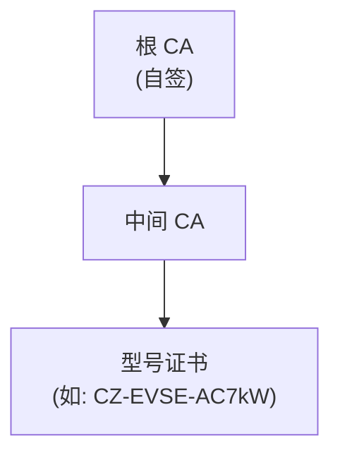
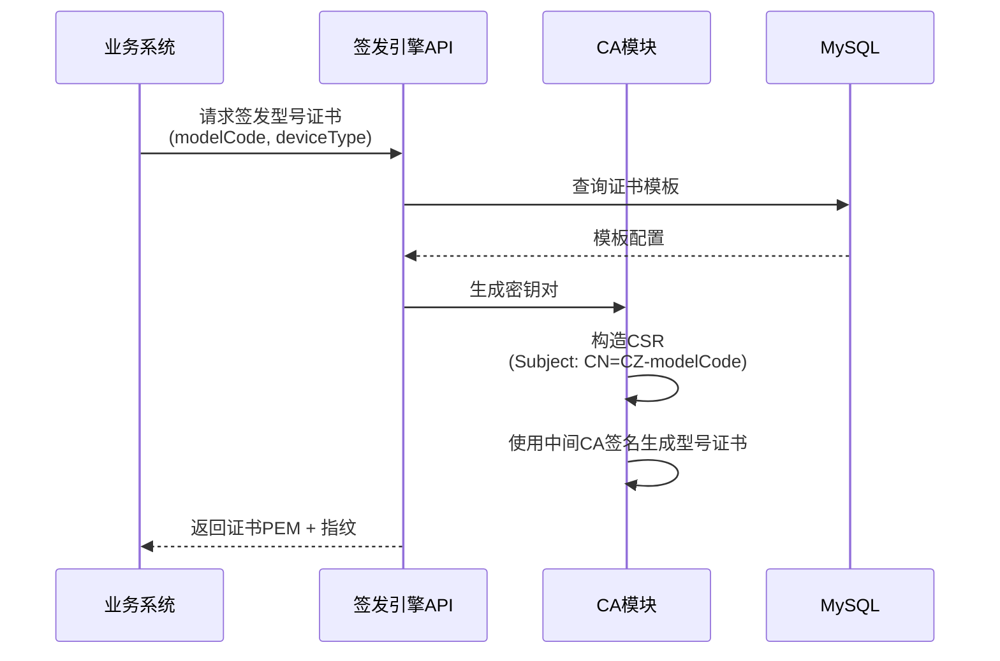

# 充电桩-证书签发架构设计

## 1. 文档目的

本文档定义充电桩证书签发架构的设计方案，聚焦于：

- 证书链结构（根 CA → 中间 CA → 型号证书）
- 证书字段设计（Subject、密钥算法、Key Usage 等）
- 签发流程

模板设计、算法选型、TLS 协议等作为签发架构的支撑内容一并设计。

以下内容不在本方案范围内，将在后续专题中细化：

- 私钥安全管理（离线根 CA 方案）
- 证书生命周期（吊销、CRL）
- API 详细设计

---

## 2. 总体架构

### 2.1 证书链结构



### 2.2 组件职责

| #   | 组件          | 职责                                   |
| --- | ------------- | -------------------------------------- |
| 1   | 根 CA（自签） | 自签名，生成中间 CA 证书，私钥离线存储 |
| 2   | 中间 CA       | 签发型号证书，支持吊销管理             |
| 3   | 证书模板      | 按设备类型定义证书字段模板             |
| 4   | 签发引擎      | 提供 RESTful API，支持型号证书签发     |

---

## 3. 证书设计

### 3.1 根 CA

| #   | 字段                                  | 值                       |
| --- | ------------------------------------- | ------------------------ |
| 1   | Country (C)                           | CN                       |
| 2   | Province (ST)                         | [省份拼音，如 shanxi]    |
| 3   | Location (L)                          | [地市拼音，如 taiyuan]   |
| 4   | Organization (O)                      | [公司名称]               |
| 5   | OrganizationIdentifier (OID 2.5.4.97) | 统一社会信用代码（18位） |
| 6   | Common Name (CN)                      | [公司名] Root CA         |
| 7   | 有效期                                | 99 年                    |
| 8   | 密钥算法                              | ECDSA P-256              |

### 3.2 中间 CA

| #   | 字段                                  | 值                       |
| --- | ------------------------------------- | ------------------------ |
| 1   | Country (C)                           | CN                       |
| 2   | Province (ST)                         | [省份拼音]               |
| 3   | Location (L)                          | [地市拼音]               |
| 4   | Organization (O)                      | [公司名称]               |
| 5   | OrganizationIdentifier (OID 2.5.4.97) | 统一社会信用代码（18位） |
| 6   | Common Name (CN)                      | [公司名] Intermediate CA |
| 7   | 有效期                                | 99 年                    |
| 8   | 密钥算法                              | 与根 CA 一致             |

### 3.3 型号证书

根据 GB/T 44130.5 附录 B.2，CN 格式采用"类型编号 + 唯一编号"：

| #   | 场景   | 类型标识 | 适用对象           | 本方案实现            |
| --- | ------ | -------- | ------------------ | --------------------- |
| 1   | A (PT) | PT       | 充换电服务平台证书 | ✅ 已支持（平台证书） |
| 2   | B (CZ) | CZ       | 充换电基础设施证书 | ✅ 已支持（型号证书） |
| 3   | C (DV) | DV       | 特定产品证书       | 预留                  |
| 4   | D (GJ) | GJ       | 固件升级证书       | 预留                  |

**本方案采用场景 B（充电基础设施证书），按型号粒度签发**：`CN = CZ[型号编号]`，同一型号的所有设备共用一张型号证书。

#### 3.3.1 型号证书字段

| #   | 字段                                  | 值                                  |
| --- | ------------------------------------- | ----------------------------------- |
| 1   | Country (C)                           | CN                                  |
| 2   | Province (ST)                         | [省份拼音]                          |
| 3   | Location (L)                          | [地市拼音]                          |
| 4   | Organization (O)                      | [公司名称]                          |
| 5   | OrganizationIdentifier (OID 2.5.4.97) | 统一社会信用代码（18位）            |
| 6   | Common Name (CN)                      | `CZ[型号编号]`，如 `CZ-EVSE-AC7kW`  |
| 7   | 有效期                                | 99 年（可配置）                     |
| 8   | 密钥算法                              | ECDSA P-256                         |
| 9   | Key Usage                             | Digital Signature, Key Encipherment |
| 10  | Extended Key Usage                    | TLS Web Client Authentication       |

#### 3.3.2 平台证书字段（预留）

| #   | 字段                                  | 值                                  |
| --- | ------------------------------------- | ----------------------------------- |
| 1   | Country (C)                           | CN                                  |
| 2   | Province (ST)                         | [省份拼音]                          |
| 3   | Location (L)                          | [地市拼音]                          |
| 4   | Organization (O)                      | [公司名称]                          |
| 5   | OrganizationIdentifier (OID 2.5.4.97) | 统一社会信用代码（18位）            |
| 6   | Common Name (CN)                      | `PT[平台编号]`                      |
| 7   | Serial Number                         | 平台唯一编号                        |
| 8   | 有效期                                | 99 年（可配置）                     |
| 9   | 密钥算法                              | ECDSA P-256                         |
| 10  | Key Usage                             | Digital Signature, Key Encipherment |
| 11  | Extended Key Usage                    | TLS Web Server Authentication       |

---

## 4. 密码与协议

### 4.1 算法选型

| #   | 场景     | 推荐算法 | 密钥长度 / 曲线   | 说明             |
| --- | -------- | -------- | ----------------- | ---------------- |
| 1   | 根 CA    | ECDSA    | P-256 (secp256r1) | 安全性高，密钥短 |
| 2   | 中间 CA  | ECDSA    | P-256             | 与根 CA 一致     |
| 3   | 型号证书 | ECDSA    | P-256             | 签名验签性能优   |

### 4.2 TLS 协议与密码套件

#### 4.2.1 TLS 版本支持

| #   | TLS 版本 | 支持状态    | 说明                         |
| --- | -------- | ----------- | ---------------------------- |
| 1   | TLS 1.3  | ✅ 当前支持 | 推荐版本，前向安全，默认优先 |
| 2   | TLS 1.2  | ✅ 当前支持 | 兼容存量设备                 |

#### 4.2.2 密码套件（优先顺序）

| #   | 优先级   | 密码套件                                      | TLS 版本  | 说明                            |
| --- | -------- | --------------------------------------------- | --------- | ------------------------------- |
| 1   | **首选** | TLS_ECDHE_ECDSA_WITH_AES_128_GCM_SHA256       | 1.2 / 1.3 | 匹配 ECDSA P-256 证书，推荐使用 |
| 2   | 备选 1   | TLS_ECDHE_ECDSA_WITH_AES_256_GCM_SHA384       | 1.2 / 1.3 | 更高安全强度                    |
| 3   | 备选 2   | TLS_ECDHE_ECDSA_WITH_CHACHA20_POLY1305_SHA256 | 1.2 / 1.3 | 低功耗设备优先                  |

#### 4.2.3 TLS 1.3 升级路径

TLS 1.3 与 TLS 1.2 的主要差别在于密码套件和握手流程。当前 ECDSA P-256 证书已同时支持 TLS 1.2 和 TLS 1.3，升级 TLS 1.3 只需在服务端配置：

| #   | 配置项       | TLS 1.2 配置                    | TLS 1.3 配置（目标）          |
| --- | ------------ | ------------------------------- | ----------------------------- |
| 1   | 最大协议版本 | TLSv1.2                         | TLSv1.3                       |
| 2   | 密码套件     | `ECDHE-ECDSA-AES128-GCM-SHA256` | `TLS_AES_128_GCM_SHA256`      |
| 3   | 证书类型     | X.509                           | X.509（无需变更）             |
| 4   | 密钥用法     | Digital Signature               | Digital Signature（无需变更） |

升级步骤：

1. 服务端启用 TLS 1.3 支持（升级 OpenSSL ≥ 1.1.1 或使用 BoringSSL）
2. 配置 TLS 1.3 密码套件优先于 TLS 1.2
3. 验证设备端 TLS 1.3 兼容性
4. 全量切换

---

## 5. 模板设计

### 5.1 MySQL 表设计

#### `cert_template`（证书模板表）

| #   | 字段          | 类型         | 说明                           |
| --- | ------------- | ------------ | ------------------------------ |
| 1   | id            | BIGINT       | 主键                           |
| 2   | template_name | VARCHAR(64)  | 模板名称，如 `evse_standard`   |
| 3   | device_type   | VARCHAR(32)  | 设备类型：`evse`（充电桩）     |
| 4   | algorithm     | VARCHAR(16)  | `ECDSA`                        |
| 5   | key_size      | INT          | 密钥长度，如 256 / 2048        |
| 6   | validity_days | INT          | 有效期天数，默认 36135（99年） |
| 7   | key_usage     | VARCHAR(128) | Key Usage 扩展                 |
| 8   | ext_key_usage | VARCHAR(128) | Extended Key Usage             |
| 9   | subject_c     | VARCHAR(64)  | Country                        |
| 10  | subject_o     | VARCHAR(128) | Organization                   |
| 11  | status        | TINYINT      | 1=启用，0=停用                 |
| 12  | created_at    | DATETIME     | 创建时间                       |
| 13  | updated_at    | DATETIME     | 更新时间                       |

```sql
CREATE TABLE `cert_template` (
  `id` BIGINT UNSIGNED NOT NULL AUTO_INCREMENT COMMENT '主键',
  `template_name` VARCHAR(64) NOT NULL COMMENT '模板名称',
  `device_type` VARCHAR(32) NOT NULL COMMENT '设备类型：evse/逆变器',
  `algorithm` VARCHAR(16) NOT NULL DEFAULT 'ECDSA' COMMENT '算法：ECDSA',
  `key_size` INT NOT NULL DEFAULT 256 COMMENT '密钥长度/曲线参数',
  `validity_days` INT NOT NULL DEFAULT 36135 COMMENT '有效期天数，默认99年',
  `key_usage` VARCHAR(128) NOT NULL DEFAULT 'digitalSignature,keyEncipherment' COMMENT 'Key Usage',
  `ext_key_usage` VARCHAR(128) NOT NULL DEFAULT 'tlsWebClientAuthentication' COMMENT 'Extended Key Usage',
  `subject_c` VARCHAR(64) NOT NULL DEFAULT 'CN' COMMENT 'Country',
  `subject_o` VARCHAR(128) NOT NULL COMMENT 'Organization',
  `status` TINYINT NOT NULL DEFAULT 1 COMMENT '1=启用 0=停用',
  `created_at` DATETIME NOT NULL DEFAULT CURRENT_TIMESTAMP,
  `updated_at` DATETIME NOT NULL DEFAULT CURRENT_TIMESTAMP ON UPDATE CURRENT_TIMESTAMP,
  PRIMARY KEY (`id`),
  KEY `idx_device_type` (`device_type`, `status`)
) ENGINE=InnoDB DEFAULT CHARSET=utf8mb4 COMMENT='证书模板表';
```

### 5.2 模板示例

**充电桩标准模板（evse_standard）**：

| #   | 字段          | 值                                 |
| --- | ------------- | ---------------------------------- |
| 1   | template_name | `evse_standard`                    |
| 2   | device_type   | `evse`                             |
| 3   | algorithm     | `ECDSA`                            |
| 4   | key_size      | `256`                              |
| 5   | validity_days | `36135`（99年）                    |
| 6   | key_usage     | `digitalSignature,keyEncipherment` |
| 7   | ext_key_usage | `tlsWebClientAuthentication`       |

---

## 6. 签发流程

### 6.1 型号证书签发流程



---

## 7. API 接口设计

> ⚠️ 本节仅列出接口清单，详细设计在后续 API 方案中完善。

### 7.1 接口清单

| #   | 接口路径                          | 方法 | 说明                    |
| --- | --------------------------------- | ---- | ----------------------- |
| 1   | `/api/v1/certs/model/issue`       | POST | 签发型号证书            |
| 2   | `/api/v1/certs/model/batch-issue` | POST | 批量签发型号证书        |
| 3   | `/api/v1/certs/query`             | GET  | 查询证书（按型号/指纹） |
| 4   | `/api/v1/certs/revoke`            | POST | 吊销证书                |
| 5   | `/api/v1/templates`               | GET  | 查询证书模板列表        |
| 6   | `/api/v1/templates/{id}`          | GET  | 查询单个模板详情        |

---

## 8. 私钥安全管理

### 8.1 分级存储策略

| #   | 密钥类型     | 存储方式               | 说明                   |
| --- | ------------ | ---------------------- | ---------------------- |
| 1   | 根 CA 私钥   | 离线生成 + 物理备份    | 永不触网，工业介质存储 |
| 2   | 中间 CA 私钥 | 签发服务器本地加密存储 | 受操作系统权限保护     |
| 3   | 型号证书私钥 | 签发服务器本地加密存储 | 签发后保留用于更新     |

### 8.2 根 CA 私钥：离线生成 + 物理备份方案

#### 8.2.1 生成环境

| #   | 项目     | 要求                                        |
| --- | -------- | ------------------------------------------- |
| 1   | 生成设备 | 专用离线电脑（永不联网）                    |
| 2   | 操作系统 | 推荐使用纯净的 Linux 启动盘（只读环境）     |
| 3   | 生成工具 | OpenSSL（离线版本）或专用的 CA 管理工具     |
| 4   | 物理介质 | 工业级 U 盘（加密存储）+ 归档光盘（冷备份） |

#### 8.2.2 操作流程

```
1. 准备阶段
   ├── 使用纯净 Linux 启动盘引导离线电脑
   ├── 断开所有网络连接
   └── 验证网络确实断开（飞行模式 + 物理网线拔除）

2. 密钥生成
   ├── 在离线电脑上生成根 CA 密钥对
   ├── 生成根 CA 自签名证书
   └── 生成中间 CA CSR 和证书

3. 物理备份
   ├── 将根 CA 私钥加密（AES-256）后存入工业 U 盘
   ├── 将备份 U 盘和归档光盘分别存入不同物理位置
   └── 将中间 CA 私钥和证书导入签发服务器
```

#### 8.2.3 备份策略

| #   | 备份类型 | 介质               | 存放位置             | 更新频率   |
| --- | -------- | ------------------ | -------------------- | ---------- |
| 1   | 在线备份 | 签发服务器加密存储 | 机房服务器           | 实时同步   |
| 2   | 热备份   | 工业 U 盘（加密）  | 机房保险柜           | 证书更新时 |
| 3   | 冷备份   | 归档光盘           | 异地安全位置（金库） | 证书更新时 |

#### 8.2.4 与 HSM 方案的差别

| #   | 对比项       | HSM 方案（国标要求）                 | 本方案（离线生成 + 物理备份）        |
| --- | ------------ | ------------------------------------ | ------------------------------------ |
| 1   | 私钥保护     | 硬件级防篡改，私钥永不离开硬件       | 依赖密码加密，私钥以加密文件形式存储 |
| 2   | 防暴力破解   | 硬件级防暴力破解（密钥被锁定或销毁） | 仅依赖加密密码强度                   |
| 3   | 防物理窃取   | 物理安全容器，拆毁即毁               | 需依靠物理保管措施                   |
| 4   | 防未授权访问 | 多因素认证（如 PIN + 生物识别）      | 依赖物理介质保管和访问控制           |
| 5   | 操作审计     | HSM 内置审计日志，不可篡改           | 需依赖操作日志系统                   |
| 6   | 成本         | 较高（专用硬件 5~20 万+）            | 较低（工业 U 盘 + 光盘 + 离线电脑）  |
| 7   | 合规性       | ✅ 完全满足国标要求                  | ⚠️ 不满足 HSM 强制性要求（合规例外） |

### 8.3 根 CA 私钥访问控制

- 离线密钥由专人保管，存取需登记
- 操作日志完整记录（签发服务器层面）
- 定期验证备份介质完整性（每年一次）

---

## 9. 证书生命周期

> ⚠️ 本节内容为初步设计，后续方案中会进一步细化。

### 9.1 吊销流程

当设备丢失或证书泄露时：

1. 调用吊销接口：`POST /api/v1/certs/revoke`
2. 将证书序列号写入吊销列表
3. 触发 CRL 重新生成
4. 推送 CRL 到设备或网关

### 9.2 CRL 配置

| #   | 字段     | 值                                |
| --- | -------- | --------------------------------- |
| 1   | 更新频率 | 每日凌晨 + 实时触发               |
| 2   | 分发点   | `http://crl.[domain]/root-ca.crl` |
| 3   | 有效期   | 24 小时                           |

---

## 10. 附注

### 10.1 GB/T 44130.5—2025 合规性说明

#### 10.1.1 满足项

本方案已满足以下国标要求：

| #   | 条款            | 要求                                     | 当前实现                                                   |
| --- | --------------- | ---------------------------------------- | ---------------------------------------------------------- |
| 1   | X.509 v3        | 证书采用 X.509 v3 格式                   | ✅ 证书采用 X.509 v3 扩展字段                              |
| 2   | 算法强度        | ECC ≥ 256                                | ✅ ECDSA P-256                                             |
| 3   | 私钥存储        | 根 CA 私钥应使用 HSM/KMS 存储            | ⚠️ 第一阶段采用离线生成+物理备份（工业U盘+光盘），暂无 HSM |
| 4   | 吊销机制        | 支持 CRL 吊销列表                        | ✅ CRL 生成与分发机制已设计                                |
| 5   | CSR 字段 (C/O)  | 证书请求包含 C、O 字段                   | ✅ 已包含 Country 和 Organization                          |
| 6   | CSR 字段 (ST/L) | 证书请求包含 ST、L 字段                  | ✅ 已包含 Province 和 Location                             |
| 7   | CSR 字段 (OID)  | OrganizationIdentifier 使用 OID 2.5.4.97 | ✅ 已映射统一社会信用代码                                  |
| 8   | 证书用途        | Key Usage / Extended Key Usage           | ✅ 已在证书扩展中明确                                      |
| 9   | 传输编码        | PEM 编码格式                             | ✅ API 返回证书使用 PEM 格式                               |

#### 10.1.2 暂不满足项（合规例外）

以下条目暂不遵守国标要求，后续迭代修订：

| #   | 条款          | 国标要求                                         | 当前方案                                  | 原因                                                    |
| --- | ------------- | ------------------------------------------------ | ----------------------------------------- | ------------------------------------------------------- |
| 1   | B.2.3 CN 粒度 | CZ 证书编号为桩的唯一编号，一桩一号              | CZ 证书编号为型号编号，一型一号           | 同型号设备共用证书，简化管理                            |
| 2   | B.2.3 CN 格式 | CN = `CZ[桩唯一编号]`                            | CN = `CZ[型号编号]`，如 `CZ-EVSE-AC7kW`   | 同上                                                    |
| 3   | 证书有效期    | 参与信息交换各方证书有效期不超过 5 年            | 当前有效期 99 年                          | 设备规模大，频繁更换成本高                              |
| 4   | emailAddress  | 证书请求应包含邮箱字段                           | 不包含邮箱字段                            | 业务不需要此字段                                        |
| 5   | 签名算法      | 优先采用 SM2 国家认定签名算法                    | 采用 ECDSA（国际算法）                    | 设备端国密支持待落地                                    |
| 6   | 哈希算法      | 优先采用 SM3 国家认定哈希算法                    | 采用 SHA-256（国际算法）                  | 设备端国密支持待落地                                    |
| 7   | TLCP 国密套件 | 优先采用 TLCP，支持 `ECDHE_SM4_GCM_SM3`          | 暂不支持国密算法                          | 设备端国密支持待落地                                    |
| 8   | 快速过期证书  | 高安全场景有效期 ≤ 24h                           | 当前最短有效期 99 年                      | 暂未定义短效模板                                        |
| 9   | 私钥安全传输  | 间接申请时代生成私钥需加密后下发                 | API 仅返回证书，私钥由设备侧生成          | 设备 CSR 流程待设计                                     |
| 10  | HSM 私钥存储  | 根 CA 私钥应存储于 HSM（硬件级防篡改、不可导出） | 采用离线生成+物理备份方案（加密文件存储） | 暂无 HSM 设备；离线方案无法满足硬件防篡改和不可导出要求 |

### 10.2 待协调工作

| #   | 事项                   | 说明                                    | 优先级 |
| --- | ---------------------- | --------------------------------------- | ------ |
| 1   | 采购专用存储介质       | 工业级 U 盘（支持硬件加密）和归档级光盘 | 高     |
| 2   | 确定离线电脑管理责任人 | 明确离线电脑的日常管理和操作规范        | 高     |
| 3   | 协调异地备份存放地点   | 确定冷备份光盘的异地安全存放位置        | 中     |

### 10.3 后续扩展

- [ ] 支持 OCB（国密）算法
- [ ] 支持 ACME 协议自动化证书更新
- [ ] 支持证书透明度日志（CT Log）
- [ ] 签发引擎集群化部署
